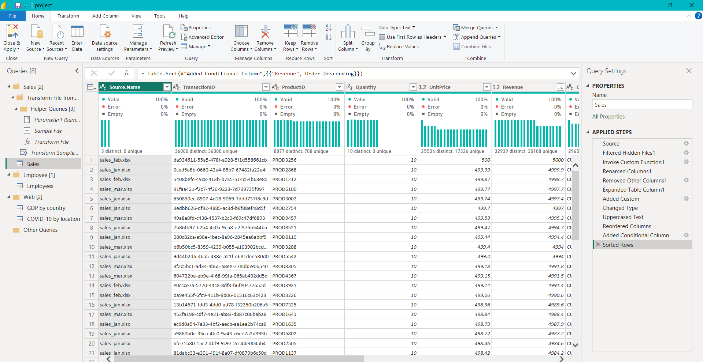
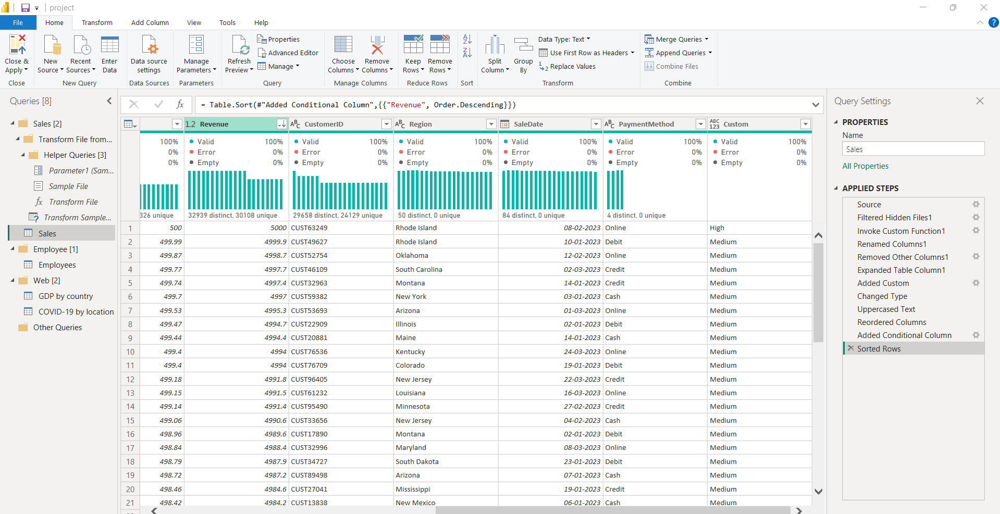
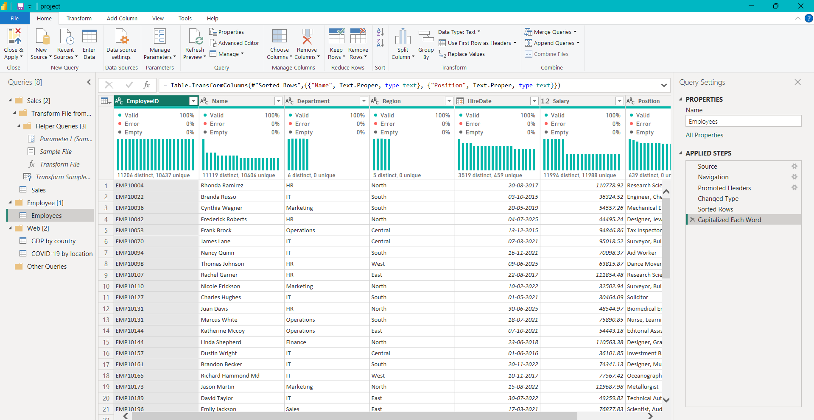
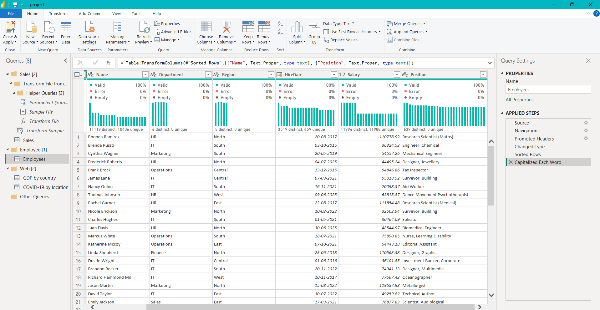
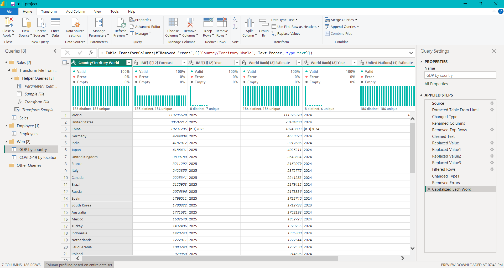
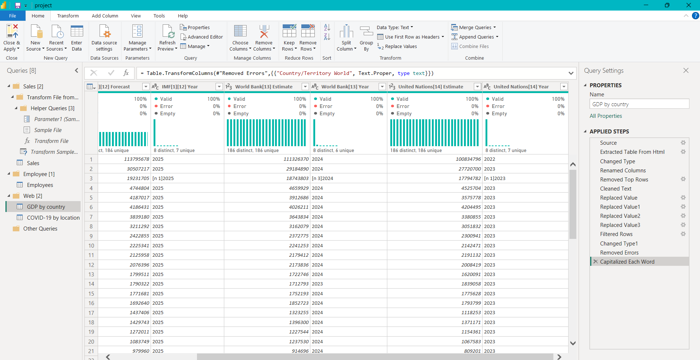
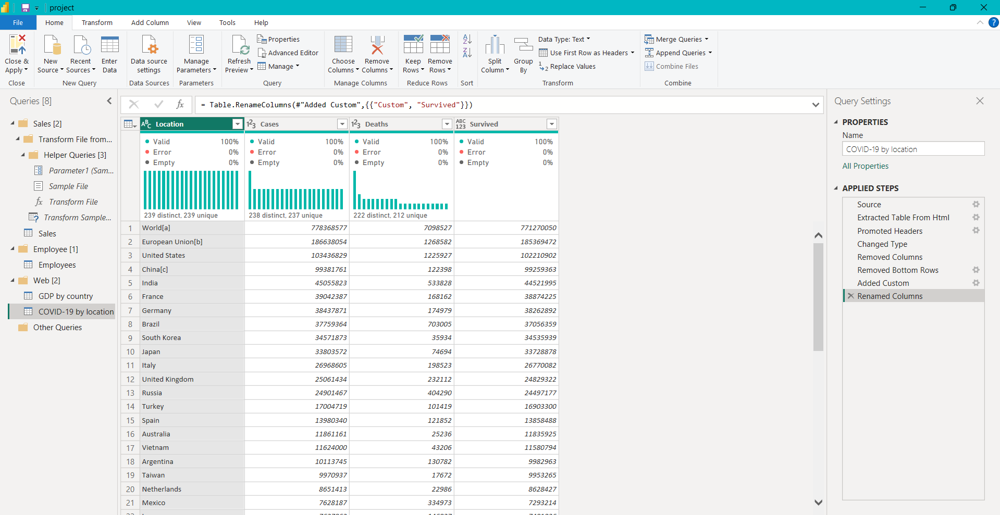

# MS_Power_BI_PR.-1-Data-Leverager

> **Objective:** Simulate a data engineering scenario using **Power BI’s Power Query Editor** to extract, clean, reshape, and combine data from multiple sources using essential ETL tools and techniques.  
> **Focus:** *Data cleaning, preparation, integration, and transformation only — no visualization or DAX.*

---

## 📋 Project Overview
This project was assigned as an internal ETL-only task to demonstrate **end-to-end data transformation workflows** in Power BI using **Power Query**.  
It involves:
- Extracting data from multiple sources (web, Excel, and folders)
- Applying a variety of transformation techniques
- Simulating refresh and parameter-driven configurations
- Ensuring clean, structured, and ready-to-use datasets

---

## 🛠 Features & Techniques Used
1. **Data Extraction**
   - HTML table from web (e.g., Wikipedia country GDP, COVID stats)
   - Multiple Excel files from a folder using `Append Queries from Folder`
   - Employee dataset from another Excel file

2. **Basic Transformations**
   - Remove blanks, promote headers, rename columns
   - Change data types with locale settings for currency/dates
   - Remove duplicates and null values

3. **Text Tools**
   - `UPPER()`, `LOWER()`, `TRIM()`, `CLEAN()`, `REPLACE()`
   - `SPLIT COLUMN BY DELIMITER` for cleaning names and addresses

4. **Numeric Tools**
   - Round revenue to 2 decimal places
   - Create calculated columns (e.g., `Profit = Revenue – Cost`)

5. **Date & Time Tools**
   - Extract Year, Month, Quarter from `Order Date`
   - Create a custom Fiscal Month column
   - Calculate Age from `Birthdate`

6. **Conditional Columns & Indexing**
   - Sales Category classification (High, Medium, Low)
   - Add index columns (0-based & 1-based)

7. **Pivoting & Unpivoting**
   - Convert monthly columns into a single column
   - Restore normalized form with unpivoting

8. **Merging & Appending**
   - Merge sales with employee data
   - Append monthly sales data

9. **Grouping & Aggregation**
   - Group by Region to compute Total Sales, Avg Order Value, Transaction Count

10. **Data Profiling & Quality**
    - Column Profile, Column Distribution, Column Quality
    - Identify missing values & detect errors

11. **Source Settings & Parameters**
    - Dynamic folder path configuration with `Parameters`
    - Manage data source credentials

12. **Refresh Simulation**
    - Simulate adding new monthly files (e.g., `Sales_Apr.xlsx`)
    - Verify auto-loading and transformation maintenance

---

## 📂 Repository Structure
```
📦 MS_Power_BI_PR.-1-Data-Leverager
├── 📂 Data
│ ├── 📂 employee
│ │ └── 🗄️ employee_records.xlsx
│ ├── 📂 Sales
│ │ ├── 🗄️ sales_jan.xlsx
│ │ ├── 🗄️ sales_feb.xlsx
│ │ └── 🗄️ sales_mar.xlsx
│ ├── 📂 Web
│ │ ├── 🔗 covid_stats.url
│ └─└── 🔗 gdp_by_country.url
├── 💻 project.pbix
├── 📄 report.pdf
└── 📜 README.md
```

---

## 🚀 Getting Started
### Prerequisites
- **Microsoft Power BI Desktop** (latest version recommended)
- Sample dataset files (included in `Data/` folder)

### Steps
1. Clone the repository:
   ```bash
   git clone https://github.com/Prath-Digital/MS_Power_BI_PR.-1-Data-Leverager.git
   ```
2. Open `Data Leverager.pbix` in Power BI Desktop.
3. Ensure folder path parameters are correctly set in **Manage Parameters**.
4. Load and review transformed datasets in Power Query.

---

## 📸 Screenshots / Demo

### Sales



### Employees



### Web
#### GDP by country



#### COVID-19


### All in one GIF


---

## 📄 Submission Requirements
- `.pbix` file with all Power Query transformations
- Documentation (`PDF` or `Markdown`) summarizing:
  - Data sources used
  - Transformations applied
  - Challenges faced and solutions

---

## 📜 License
Distributed under the MIT License. See `LICENSE` for more details.

---

## 👤 Author
**Prath** – Data Science & AI/ML Enthusiast  
GitHub: [Prath-Digital](https://github.com/Prath-Digital)
